# Spring PetClinic – DevOps Project

A hands-on DevOps project based on the Spring PetClinic application.

The project demonstrates the complete journey of a Spring Boot application from running locally with MySQL to a containerized deployment using Docker and Docker Compose.

## Project Overview

The project is divided into three main tasks:

```text
                    Spring PetClinic
                         |
        +----------------+----------------+
        |                                 |
   Task 1: Local                    Task 2: Docker
        |                                 |
      MySQL                       Single / Multi-Stage
                                          |
                                          ↓
                                 Task 3: Compose
                                          |
                                +---------+---------+
                                |                   |
                           PetClinic             MySQL
                                |                   |
                                +------ Network ----+
                                          |
                                    Named Volume
```

### Task 1 — Local Application + MySQL

Run Spring PetClinic locally, configure MySQL manually, connect the application to MySQL, and verify database operations through the UI and MySQL.

### Task 2 — Dockerization

Containerize the application using Single-Stage and Multi-Stage Docker builds and compare the resulting image sizes.

### Task 3 — Docker Compose

Run PetClinic and MySQL as separate containers, configure Docker networking and environment variables, use persistent storage, run the application as a non-root user, and verify database persistence.

---

# Task 1 — Local Application + MySQL

## Project Goal

In this task, we will:

* Clone the Spring PetClinic project.
* Install and check Java and MySQL.
* Test the application locally.
* Create a MySQL database and user.
* Connect PetClinic to MySQL.
* Check the database tables and sample data.
* Add a new owner through the UI.
* Verify the new owner directly in MySQL.

---

## 1. Create a Projects Directory

Create a directory for DevOps projects:

```bash
mkdir -p ~/DevOps-Projects

cd ~/DevOps-Projects
```

---

## 2. Clone the Repository

Clone the official Spring PetClinic repository:

```bash
git clone https://github.com/spring-projects/spring-petclinic.git

cd spring-petclinic
```

Check the project files:

```bash
ls
```

Check Git status:

```bash
git status
```

### Why?

`git clone` downloads the project from GitHub, and `cd` moves into the project directory.

---

## 3. Install and Check Java

Spring PetClinic is a Java Spring Boot application, so Java is required.

Check Java:

```bash
java --version
```

or:

```bash
java -version
```

If Java is not installed:

```bash
sudo apt update

sudo apt install openjdk-17-jdk -y
```

Check the Maven Wrapper:

```bash
./mvnw -version
```

### Why?

* `java -version` checks the installed Java version.
* `./mvnw -version` checks the Maven version used by the project.

---

## 4. Install and Check MySQL

MySQL will be used as the database.

Install MySQL:

```bash
sudo apt update

sudo apt install mysql-server -y
```

Check the MySQL version:

```bash
mysql --version
```

Check the MySQL service:

```bash
sudo systemctl status mysql
```

If MySQL is not running:

```bash
sudo systemctl start mysql
```

---

## 5. Test the Application

Before connecting MySQL, test that the PetClinic application can build and run.

Run:

```bash
./mvnw spring-boot:run
```

Open the application:

```text
http://localhost:8080
```

The application should open successfully.

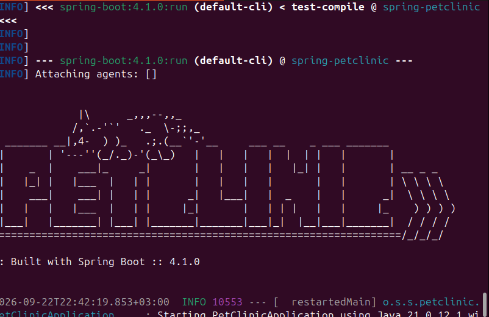

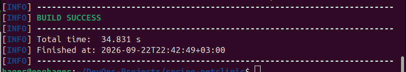

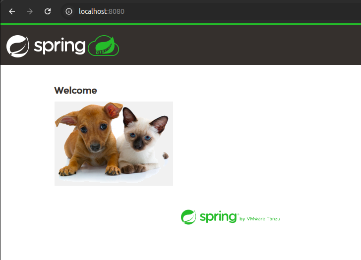

### Why?

This is the first test to make sure the application itself works before configuring the MySQL database.

Stop the application:

```text
Ctrl + C
```

---

## 6. Open MySQL

Open the MySQL shell:

```bash
sudo mysql
```

We will now create the database and user needed by PetClinic.

---

## 7. Create the PetClinic Database

Create the database:

```sql
CREATE DATABASE petclinic;
```

### Why?

This creates an empty MySQL database called `petclinic`.

---

## 8. Create a MySQL User

Create a user for the PetClinic application:

```sql
CREATE USER 'petclinic'@'localhost' IDENTIFIED BY 'petclinic';
```

Give this user permission to use the database:

```sql
GRANT ALL PRIVILEGES ON petclinic.* TO 'petclinic'@'localhost';
```

Exit MySQL:

```sql
EXIT;
```

### What did we create manually?

```text
Database:
petclinic

MySQL User:
petclinic

Password:
petclinic
```

We did **not** manually create the PetClinic tables.

---

## 9. Test the Database Connection

Test the new MySQL user:

```bash
mysql -u petclinic -p -h localhost petclinic
```

Enter the password:

```text
petclinic
```

If the connection works, the user can access the `petclinic` database.

Exit MySQL:

```sql
EXIT;
```

---

## 10. Run PetClinic Using MySQL

Go back to the project:

```bash
cd ~/DevOps-Projects/spring-petclinic
```

Run PetClinic with the MySQL profile:

```bash
./mvnw spring-boot:run -Dspring-boot.run.profiles=mysql
```

### Why use the `mysql` profile?

The MySQL profile tells Spring Boot to use MySQL as the application's database.

Open:

```text
http://localhost:8080
```

### Application Flow

```text
Browser
   ↓
Spring Boot / PetClinic
   ↓
MySQL
   ↓
petclinic database
```

---

## 11. Check the Database Tables

Connect to the database:

```bash
mysql -u petclinic -p -h localhost petclinic
```

Show the tables:

```sql
SHOW TABLES;
```
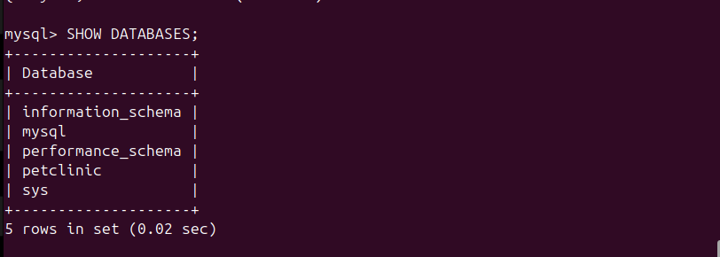

You should see tables such as:

```text
owners
pets
specialties
types
vet_specialties
vets
visits
```

### Important

We did not create these tables manually.

The PetClinic application initializes the required database structure when it starts with the MySQL profile.

---

## 12. Check the Existing Data

Check the owners table:

```sql
SELECT * FROM owners;
```

The database already contains PetClinic sample/demo data.

The first owners are provided by the PetClinic project.

### Important

We did **not** manually insert these first owners.

```text
We created manually:

    ↓

petclinic database
petclinic MySQL user

PetClinic initialized:

    ↓

database tables
sample/demo data
```

---

## 13. Add a New Owner From the UI

Open:

```text
http://localhost:8080
```

Go to:

```text
Owners → Add Owner
```

Enter:

```text
First Name: Hager
Last Name: Shohieb
Address: Cairo
City: Cairo
Telephone: 1234567890
```

Then save the owner.

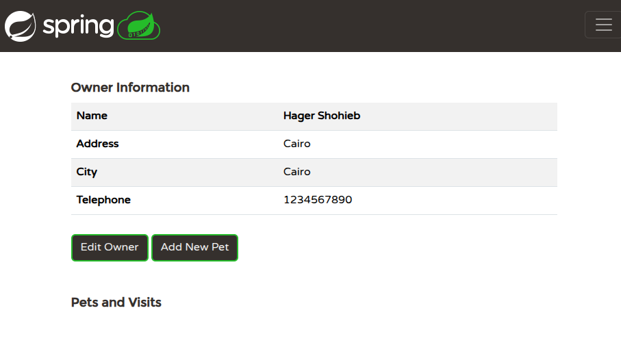

### Why?

This tests that the application can receive data from the UI and save it into MySQL.

---

## 14. Verify the New Owner in MySQL

Connect to the database:

```bash
mysql -u petclinic -p -h localhost petclinic
```

Run:

```sql
SELECT * FROM owners;
```

The table should now contain the existing sample owners plus the new owner.

For example:

```text
1   George Franklin
2   Betty Davis
...
10  Carlos Esteban
11  Hager Shohieb
```

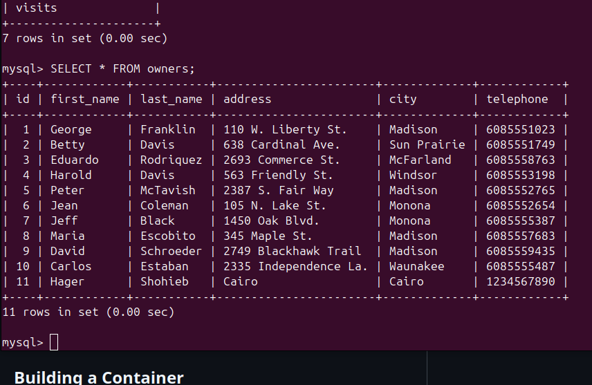

The new owner has ID `11` because there were already 10 sample owners.

### Important

We did not use an SQL `INSERT` command to create Hager.

We added Hager through the web application.

---

## 15. How the Data Reached MySQL

When we added the owner from the browser, the data followed this flow:

```text
Browser
   ↓
Spring Boot
   ↓
OwnerController
   ↓
Repository / JPA / Hibernate
   ↓
MySQL
   ↓
owners table
```

So the browser sends the form data to the Spring Boot application, and the application saves it into MySQL.

---

# Database Summary

## What We Created Manually

### Database

```sql
CREATE DATABASE petclinic;
```

### MySQL User

```sql
CREATE USER 'petclinic'@'localhost' IDENTIFIED BY 'petclinic';
```

### Permissions

```sql
GRANT ALL PRIVILEGES ON petclinic.* TO 'petclinic'@'localhost';
```

## What PetClinic Initialized

```text
Database tables
+
Sample/demo data
```

## What We Added

```text
Hager Shohieb
```

We added this owner through the PetClinic web UI.

---

# Task 2 — Dockerize the Application

The application was containerized using two approaches:

* Single-Stage Docker Build
* Multi-Stage Docker Build

The goal was to build and run the application in Docker and compare the final image sizes.

---

## 1. Add the Dockerfile

For the first Docker image, I used a **Single-Stage Dockerfile**.

```dockerfile
FROM eclipse-temurin:17-jdk

WORKDIR /app

COPY . .

RUN chmod +x mvnw

RUN ./mvnw package -DskipTests

COPY target/*.jar app.jar

EXPOSE 8080

CMD ["java", "-jar", "app.jar"]
```

### Explanation

* `FROM eclipse-temurin:17-jdk` → Uses Java 17 JDK as the base image.
* `WORKDIR /app` → Sets `/app` as the working directory.
* `COPY . .` → Copies the project files into the container.
* `RUN chmod +x mvnw` → Gives the Maven Wrapper execute permission.
* `RUN ./mvnw package -DskipTests` → Builds the Spring Boot application.
* `COPY target/*.jar app.jar` → Copies the generated JAR file.
* `EXPOSE 8080` → Documents that the application uses port 8080.
* `CMD` → Starts the Spring Boot application.

---

## 2. Build the Single-Stage Image

```bash
docker build -t petclinic-single-stage .
```

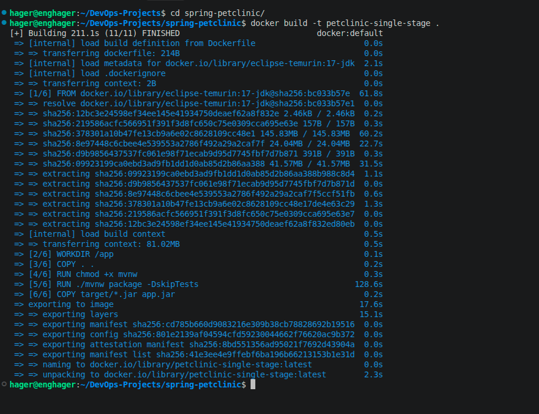

---

## 3. Check the Single-Stage Image Size

```bash
docker images petclinic-single-stage
```

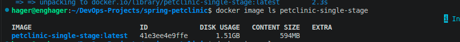

The single-stage image has a content size of approximately **594 MB**.

---

## 4. Run the Single-Stage Container

```bash
docker run -d --name petclinic-single -p 8080:8080 petclinic-single-stage
```

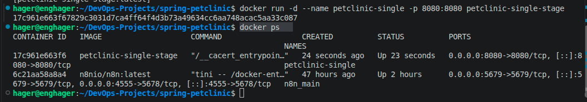

---

## 5. Check the Application

Open:

```text
http://localhost:8080
```

The PetClinic application is now running inside the Docker container.

### Database Verification

After adding a new owner through the PetClinic UI, the new data was not appearing in the MySQL database used in the previous local setup.

This is because the Docker container is currently running with its own application/database configuration and is not automatically connected to the previously configured MySQL environment.

This will be handled in the next Docker Compose task, where the application and database will be configured together.

---

# Multi-Stage Docker Build

To reduce the final image size, I created a **Multi-Stage Dockerfile**.

## 6. Add the Multi-Stage Dockerfile

```dockerfile
# Stage 1: Build the application
FROM eclipse-temurin:17-jdk AS builder

WORKDIR /app

COPY . .

RUN ./mvnw clean package -DskipTests

# Stage 2: Create the final runtime image
FROM eclipse-temurin:17-jre

WORKDIR /app

COPY --from=builder /app/target/*.jar app.jar

EXPOSE 8080

CMD ["java", "-jar", "app.jar"]
```

### Why use Multi-Stage Build?

The Dockerfile has two stages.

### Stage 1 — Build

```dockerfile
FROM eclipse-temurin:17-jdk AS builder
```

The JDK and Maven are used to build the application and generate the JAR file.

### Stage 2 — Runtime

```dockerfile
FROM eclipse-temurin:17-jre
```

The final image only needs the Java Runtime Environment to run the generated JAR.

```dockerfile
COPY --from=builder /app/target/*.jar app.jar
```

Only the generated JAR is copied from the build stage into the final image.

```text
              Docker Build
                   |
        +----------+----------+
        |                     |
     Stage 1               Stage 2
     Builder                Runtime
        |                     |
   JDK + Maven                JRE
        |                     |
    Build JAR                 |
        +---------> app.jar <-+
                              |
                              ↓
                       Final Container
```

This prevents the build environment and unnecessary build files from being included in the final runtime image.

---

## 7. Build the Multi-Stage Image

```bash
docker build -f Dockerfile.multistage -t petclinic-multistage .
```

---

## 8. Compare the Image Sizes

```bash
docker images petclinic-single-stage

docker images petclinic-multistage
```

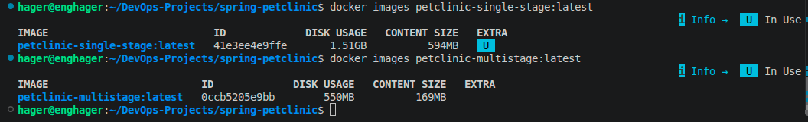

### Image Size Comparison

| Image        | Content Size |
| ------------ | -----------: |
| Single-stage |       594 MB |
| Multi-stage  |       169 MB |

The Multi-Stage image is approximately **425 MB smaller**.

```text
594 MB → 169 MB
```

The reduction comes from keeping the build environment out of the final runtime image.

---

## 9. Stop the Single-Stage Container

Before using port `8080` for the new container, stop the previous container:

```bash
docker stop petclinic-single
```

---

## 10. Run the Multi-Stage Container

```bash
docker run -d \
  --name petclinic-multistage \
  -p 8080:8080 \
  petclinic-multistage
```

---

## 11. Check the Multi-Stage Container

```bash
docker ps
```

Check the application logs:

```bash
docker logs petclinic-multistage
```

Then open:

```text
http://localhost:8080
```

The same Spring PetClinic application is now running using the smaller Multi-Stage Docker image.

---

# Task 2 Result

Two Docker approaches were implemented:

1. **Single-stage Docker build**
2. **Multi-stage Docker build**

The image sizes were:

```text
Single-stage → 594 MB
Multi-stage  → 169 MB
```

The Multi-Stage build separates the build environment from the runtime environment, resulting in a smaller final Docker image.

---

# Task 3 — Docker Compose

In this task, the Spring PetClinic application and MySQL database are running as separate Docker containers using Docker Compose.

## Task Goal

The goal is to:

* Run the application and database together.
* Connect the Spring Boot application to MySQL.
* Use Docker networking for container-to-container communication.
* Configure the database connection using environment variables.
* Use the MySQL Spring Boot profile.
* Store MySQL data in a named Docker volume.
* Run the application as a non-root user.
* Verify that data remains after recreating the containers.

---

## 1. Docker Compose Configuration

A separate Compose file was created:

```text
docker-compose.petclinic.yml
```

The Compose file contains two services:

```text
PetClinic Application
        |
        | Docker Network
        |
        ↓
MySQL Database
```

### PetClinic Service

The application is built using the Multi-Stage Dockerfile:

```yaml
petclinic:
  build:
    context: .
    dockerfile: Dockerfile.multistage
```

### MySQL Service

MySQL runs in a separate container:

```yaml
mysql:
  image: mysql:9.7
```

---

## 2. Build and Start the Containers

Start the application and database:

```bash
docker compose -f docker-compose.petclinic.yml up -d --build
```

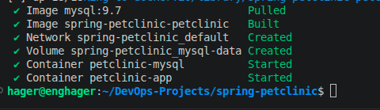

Check the running containers:

```bash
docker compose -f docker-compose.petclinic.yml ps
```

Both services should be running:

```text
petclinic-app
petclinic-mysql
```

---

## 3. Docker Networking

Docker Compose automatically creates a network for the services.

```text
                         Host
                          |
                    localhost:8080
                          |
                          ↓
              +----------------------+
              |    PetClinic App     |
              |    petclinic-app     |
              +----------------------+
                          |
                          | Docker Network
                          | mysql:3306
                          ↓
              +----------------------+
              |        MySQL         |
              |    petclinic-mysql   |
              +----------------------+
                          |
                          ↓
                    petclinic DB
                          |
                          ↓
                    mysql-data
                   Named Volume
```

The important point is that the application does **not** use `localhost` to connect to MySQL.

Inside the PetClinic container:

```text
localhost
```

means the PetClinic container itself.

Therefore, the application uses the MySQL service name:

```text
mysql
```

The database connection is:

```text
jdbc:mysql://mysql:3306/petclinic
```

Here:

* `mysql` → Docker Compose service name.
* `3306` → MySQL port.
* `petclinic` → database name.

Docker's internal DNS resolves `mysql` to the MySQL container.

### Connection Flow

```text
Browser
   |
   | localhost:8080
   ↓
PetClinic Container
   |
   | mysql:3306
   ↓
MySQL Container
   |
   ↓
petclinic database
```

---

## 4. Environment Variables

The database connection is configured using environment variables:

```yaml
environment:
  SPRING_PROFILES_ACTIVE: mysql
  MYSQL_URL: jdbc:mysql://mysql:3306/petclinic
  MYSQL_USER: petclinic
  MYSQL_PASS: petclinic
```

The MySQL Spring Boot configuration uses these variables:

```properties
spring.datasource.url=${MYSQL_URL:jdbc:mysql://localhost/petclinic}
spring.datasource.username=${MYSQL_USER:petclinic}
spring.datasource.password=${MYSQL_PASS:petclinic}
```

This allows the same application image to use different database configurations without changing the application code or rebuilding the image.

---

## 5. Activate the MySQL Profile

The application needs the Spring Boot `mysql` profile.

This is enabled through:

```yaml
SPRING_PROFILES_ACTIVE: mysql
```

Check the application logs:

```bash
docker logs petclinic-app | grep -i "profile"
```

The logs should show that the `mysql` profile is active.

---

## 6. Check the Application Logs

Check the PetClinic logs:

```bash
docker compose -f docker-compose.petclinic.yml logs petclinic
```

Check the MySQL logs:

```bash
docker compose -f docker-compose.petclinic.yml logs mysql
```

The logs help verify that both containers started correctly.

---

## 7. Check the MySQL Database

Connect to the MySQL container:

```bash
docker exec -it petclinic-mysql mysql -u petclinic -p
```

Enter the password:

```text
petclinic
```

Select the database:

```sql
USE petclinic;
```

Check the tables:

```sql
SHOW TABLES;
```

Check the existing owners:

```sql
SELECT * FROM owners;
```

The database tables and initial data are initialized by the PetClinic application.


---

## 8. Add an Owner Through the UI

Open:

```text
http://localhost:8080
```

Go to:

```text
Owners → Add Owner
```

Add a new test owner and save the data.
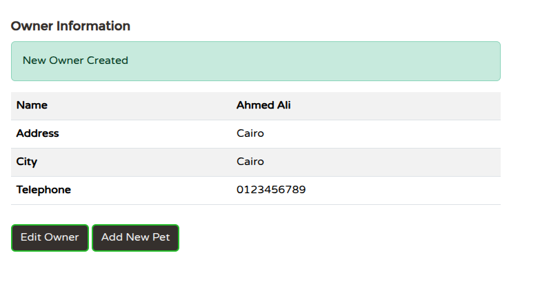


### UI → Database Flow

```text
Browser
   |
   ↓
Spring Boot / PetClinic
   |
   ↓
JPA / Hibernate
   |
   ↓
MySQL Container
   |
   ↓
owners table
```

---

## 9. Verify the Owner in MySQL

Connect to MySQL again:

```bash
docker exec -it petclinic-mysql mysql -u petclinic -p
```

Then:

```sql
USE petclinic;

SELECT * FROM owners;
```


The newly added owner should appear in the `owners` table.

This confirms that the application container is successfully connected to the MySQL container.

---

## 10. Run the Application as a Non-Root User

Running the application as `root` inside a container gives the application more privileges than necessary.

The runtime stage of `Dockerfile.multistage` uses a dedicated non-root user:

```dockerfile
FROM eclipse-temurin:17-jre

RUN useradd -r -u 1001 -g root petclinic

WORKDIR /app

COPY --from=builder /app/target/*.jar app.jar

USER petclinic

EXPOSE 8080

CMD ["java", "-jar", "app.jar"]
```

The important line is:

```dockerfile
USER petclinic
```

This means the Spring Boot application runs as the `petclinic` user instead of `root`.

### Verify the Container User

After rebuilding the image:

```bash
docker compose -f docker-compose.petclinic.yml up -d --build
```

Check the user:

```bash
docker exec petclinic-app whoami
```

Expected output:

```text
petclinic
```

---

## 11. MySQL Persistent Volume

The MySQL service uses a named Docker volume:

```yaml
volumes:
  - mysql-data:/var/lib/mysql
```

The volume is declared at the bottom of the Compose file:

```yaml
volumes:
  mysql-data:
```

### Storage Flow

```text
              MySQL Container
                    |
                    ↓
          /var/lib/mysql
                    |
                    ↓
              mysql-data
             Named Volume
```

The volume keeps the database data when the containers are removed and recreated.

---

## 12. Test Database Persistence

First, stop and remove the Compose containers:

```bash
docker compose -f docker-compose.petclinic.yml down
```

The `-v` option is intentionally not used because we want to keep the named volume.

Start the services again:

```bash
docker compose -f docker-compose.petclinic.yml up -d
```

Check the containers:

```bash
docker compose -f docker-compose.petclinic.yml ps
```

Connect to MySQL:

```bash
docker exec -it petclinic-mysql mysql -u petclinic -p
```

Then:

```sql
USE petclinic;

SELECT * FROM owners;
```

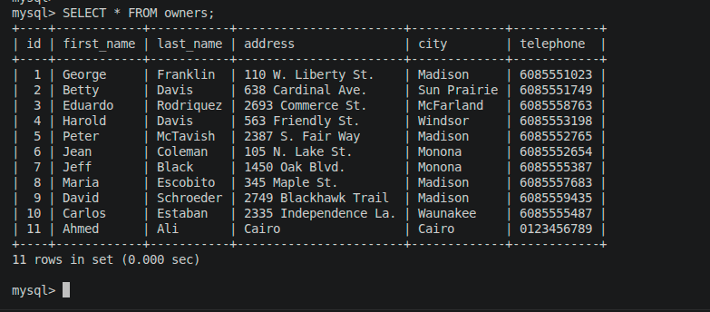

The previously added owner should still exist.

This confirms that the MySQL data was preserved by the named Docker volume.

---

## 13. Rebuild Test

When the Docker image needs to be rebuilt:

```bash
docker compose -f docker-compose.petclinic.yml up -d --build
```

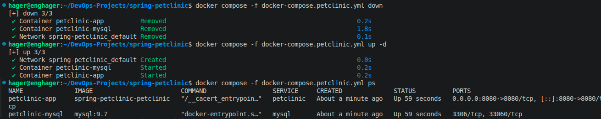

---

# Task 3 Result

The final Docker Compose setup contains two containers:

```text
                    Browser
                       |
                       | localhost:8080
                       ↓
              +-----------------+
              |  PetClinic App  |
              |  Spring Boot    |
              |  Non-root User  |
              +--------+--------+
                       |
                       | mysql:3306
                       ↓
              +-----------------+
              |      MySQL      |
              |   petclinic DB  |
              +--------+--------+
                       |
                       ↓
                mysql-data
               Named Volume
```

The project demonstrates:

* Docker Compose
* Multi-container applications
* Docker networking
* Service-name based communication
* Environment variables
* Spring Boot profiles
* MySQL containers
* Named volumes
* Data persistence
* Non-root containers
* Application-to-database communication

---

# Final Project Flow

```text
                    Spring PetClinic
                         |
        +----------------+----------------+
        |                                 |
   Task 1: Local                    Task 2: Docker
        |                                 |
      MySQL                       Single / Multi-Stage
                                          |
                                          ↓
                                 Task 3: Compose
                                          |
                                +---------+---------+
                                |                   |
                           PetClinic             MySQL
                                |                   |
                                +------ Network ----+
                                          |
                                    Named Volume
```

# Final Results

| Task   | Result                                         |
| ------ | ---------------------------------------------- |
| Task 1 | PetClinic running locally with MySQL           |
| Task 2 | Single-stage and Multi-stage Docker images     |
| Task 2 | Image size reduced from 594 MB to 169 MB       |
| Task 3 | PetClinic + MySQL running with Docker Compose  |
| Task 3 | Container-to-container networking configured   |
| Task 3 | MySQL configured through environment variables |
| Task 3 | Named volume used for persistence              |
| Task 3 | Application running as non-root                |
| Task 3 | Database persistence verified                  |

# Conclusion

This project demonstrates the complete path of the Spring PetClinic application from a local development setup to a containerized DevOps environment:

```text
Local Application
       ↓
MySQL
       ↓
Docker
       ↓
Multi-Stage Build
       ↓
Docker Compose
       ↓
Container Networking
       ↓
Persistent Storage
       ↓
Non-Root Runtime
```

The final setup successfully runs Spring PetClinic and MySQL as separate containers, connects them through a Docker network, stores database data in a named volume, and runs the application using a non-root user.
